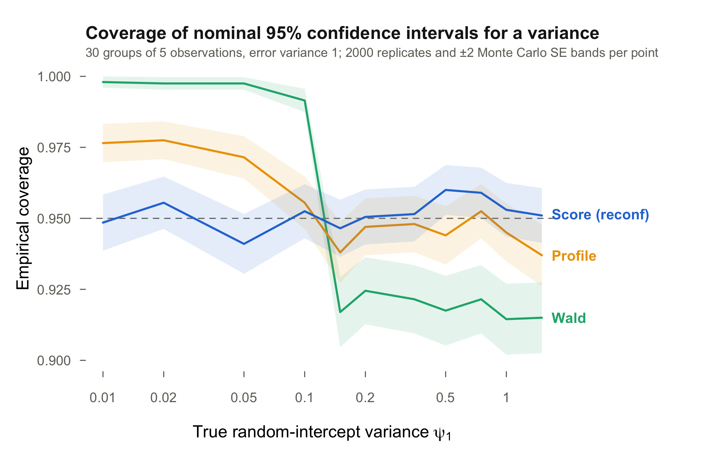

# reconf

Score-based confidence intervals and hypothesis tests for variance components in linear mixed models fitted with [lme4](https://github.com/lme4/lme4).

## Overview

Standard methods for inference on variance components — Wald intervals and likelihood ratio tests — have known deficiencies: Wald intervals can extend below zero, and both methods rely on chi-squared approximations that are unreliable in small samples or near the boundary of the parameter space.

`reconf` implements **score-based confidence intervals** that invert a one-dimensional signed score statistic. The method:

- Works directly on the natural variance/covariance parameterisation (no Cholesky reparameterization needed)
- Handles boundary cases (near-zero variances) without ad-hoc corrections
- Supports both REML and ML estimation
- Uses warm-started outward search for computational efficiency

## Coverage



Wald intervals over-cover badly near the boundary and under-cover elsewhere;
profile likelihood intervals are conservative near the boundary. The score
intervals hold their nominal level throughout, and compute roughly an order
of magnitude faster than `confint(fit, method = "profile")`. The figure is
generated by the seeded simulation in
[scripts/coverage_simulation.R](scripts/coverage_simulation.R).

## Installation

```r
# Install from GitHub
remotes::install_github("koekvall/reconf")
```

## Usage

```r
library(lme4)
library(reconf)

# Fit a linear mixed model
fit <- lmer(Reaction ~ Days + (Days | Subject), data = sleepstudy)

# 95% score-based CIs for all covariance parameters, residual variance included
ci_all_lmer(fit)

# CI for a single parameter (e.g. the random intercept variance, index 1)
ci_lmer(fit, test_idx = 1)

# Score tests of each covariance parameter against zero
score_test_all_lmer(fit)

# Joint score test: H0 that all random-effect covariance parameters are zero
score_test_lmer(fit)
```

The parameter ordering follows `as.data.frame(VarCorr(fit), order = "lower.tri")`, with the residual variance last.

## References

- **[Main reference]** Shedden, M. and Ekvall, K. O. Reliable score-based
  confidence intervals for covariance parameters in linear mixed models.
  *In preparation.* Describes the methods implemented in this package.
- **[Background / supporting theory]** Ekvall, K. O. and Bottai, M. (2026).
  Uniform inference in linear mixed models. *Biometrika* 113(1), asaf079.
  [doi:10.1093/biomet/asaf079](https://doi.org/10.1093/biomet/asaf079)
- **[Background / supporting theory]** Zhang, Y., Ekvall, K. O., and
  Molstad, A. J. (2025). Fast and reliable confidence intervals for a
  variance component. *Biometrika* 112(2), asaf010.
  [doi:10.1093/biomet/asaf010](https://doi.org/10.1093/biomet/asaf010)
- **[Background / supporting theory]** Ekvall, K. O. and Bottai, M. (2022).
  Confidence regions near singular information and boundary points with
  applications to mixed models. *The Annals of Statistics* 50(3), 1806–1832.
  [doi:10.1214/22-AOS2177](https://doi.org/10.1214/22-AOS2177)

## Related software

[varcomp](https://github.com/yqzhang5972/varcomp) (formerly
[lmmvar](https://github.com/yqzhang5972/lmmvar)) implements the method of
Zhang, Ekvall, and Molstad (2025) for a model with one variance component
and an error term, with the proportion of variability (heritability) as the
parameter of interest. `reconf` instead treats
the variances and covariances themselves as the parameters of interest and
covers all covariance parameters in models fitted with lme4.