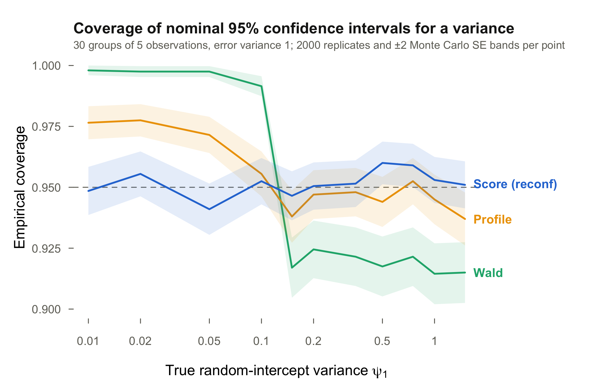

# reconf

Score-based confidence intervals and hypothesis tests for variance components in linear mixed models fitted with [lme4](https://github.com/lme4/lme4).

## Overview

`reconf` computes confidence intervals and score tests for the variances
and covariances of random effects in linear mixed models. The intervals
invert the efficient score test on the variance-covariance scale and remain
valid near the boundary of the parameter space, where Wald and likelihood
ratio intervals can be unreliable; see the references.

- Restricted (REML) and maximum likelihood fits, with prior weights and
  offsets.
- Score tests of one or several parameters, and the log-likelihood with its
  score and information at any covariance parameters.
- Sparse algebra for grouped random effects, and dense or spectral algebra
  for models with dense random-effect design matrices.

## Coverage



The figure shows the estimated coverage of 95% intervals for a
random-intercept variance, with 30 groups of 5 observations and 2000
replicates at each of eleven values of the variance. Across those values,
the coverage was between 0.941 and 0.960 for the score intervals, between
0.914 and 0.998 for Wald intervals, and between 0.937 and 0.978 for profile
likelihood intervals; the Monte Carlo standard errors are at most 0.0063.
The simulation is in
[scripts/coverage_simulation.R](https://github.com/koekvall/reconf/blob/main/scripts/coverage_simulation.R).

On the FEV1 model of the vignette, `vc_ci()` computed the four intervals in
0.7 s and `confint(fit, method = "profile")` in 28 s, in one run on a
laptop.

## Installation

```r
# Install from GitHub
remotes::install_github("koekvall/reconf")
```

## Usage

```r
library(lme4)
library(reconf)

# Fit a linear mixed model
fit <- lmer(Reaction ~ Days + (Days | Subject), data = sleepstudy)

# 95% score-based CIs for all covariance parameters, residual variance included
vc_ci(fit)

# CI for selected parameters, by name or index
vc_ci(fit, parm = "var_(Intercept)|Subject")

# Score test that the random slope variance (index 3) is zero
vc_test(fit, parm = 3)

# Score test that all random-effect covariance parameters are zero
vc_test(fit)

# Build the model once to reuse its precomputation across calls
m <- vc_model(fit)
vc_ci(m, parm = 3)

# Log-likelihood, score, and information at any covariance parameters
ll <- vc_loglik(fit)
ll(c(600, 10, 35, 650))
```

The parameter ordering follows `as.data.frame(VarCorr(fit), order = "lower.tri")`, with the residual variance last.

## References

- **[Main reference]** Shedden, M. and Ekvall, K. O. Reliable score-based
  confidence intervals for covariance parameters in linear mixed models.
  *In preparation.* Describes the methods implemented in this package.
- **[Background / supporting theory]** Ekvall, K. O. and Bottai, M. (2026).
  Uniform inference in linear mixed models. *Biometrika* 113(1), asaf079.
  [doi:10.1093/biomet/asaf079](https://doi.org/10.1093/biomet/asaf079)
- **[Background / supporting theory]** Zhang, Y., Ekvall, K. O., and
  Molstad, A. J. (2025). Fast and reliable confidence intervals for a
  variance component. *Biometrika* 112(2), asaf010.
  [doi:10.1093/biomet/asaf010](https://doi.org/10.1093/biomet/asaf010)
- **[Background / supporting theory]** Ekvall, K. O. and Bottai, M. (2022).
  Confidence regions near singular information and boundary points with
  applications to mixed models. *The Annals of Statistics* 50(3), 1806–1832.
  [doi:10.1214/22-AOS2177](https://doi.org/10.1214/22-AOS2177)

## Related software

[varcomp](https://github.com/yqzhang5972/varcomp) (formerly
[lmmvar](https://github.com/yqzhang5972/lmmvar)) implements the method of
Zhang, Ekvall, and Molstad (2025) for a model with one variance component
and an error term, with the proportion of variability (heritability) as the
parameter of interest. `reconf` instead treats
the variances and covariances themselves as the parameters of interest and
covers all covariance parameters in models fitted with lme4.